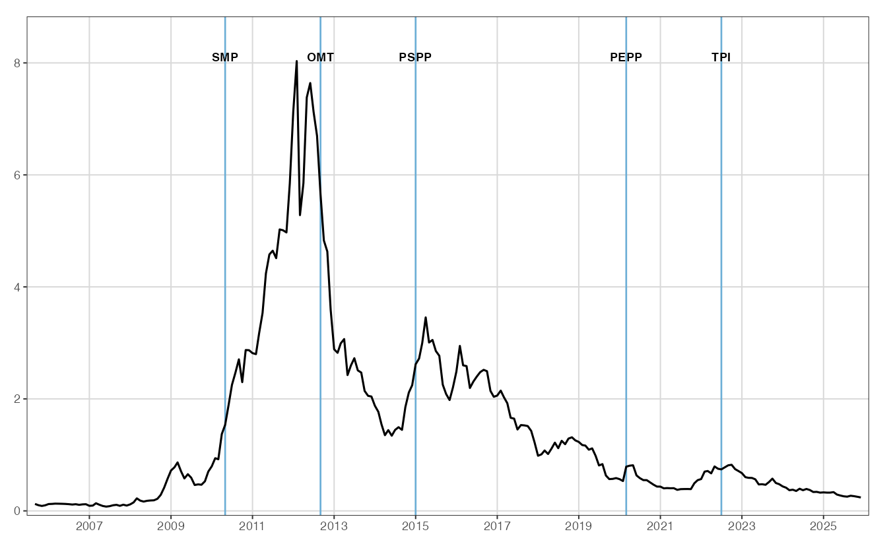
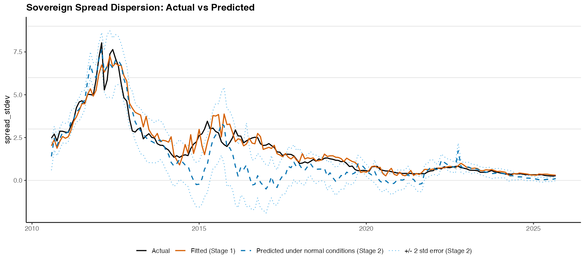
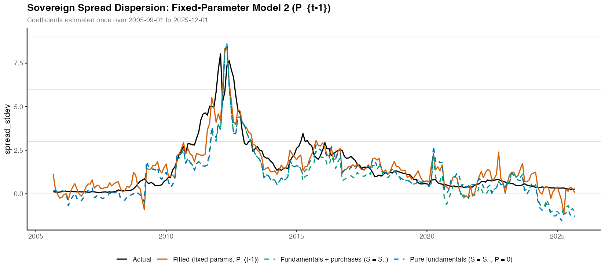

# ECB Asset Purchases and Sovereign Bond Spread Fragmentation

Data pipeline and estimation code for a bachelor's thesis on the effect of ECB
asset purchase programmes (SMP, PSPP, PEPP) on the fragmentation of euro-area
sovereign bond spreads, following the moments-based approach of Kakes and van
den End (2024).

## Abstract

> This paper examines whether sovereign bond market fragmentation in the euro
> area can be decomposed into fundamental and non-fundamental components, and
> whether ECB asset purchase programs have been effective at countering the
> latter. This study mirrors Kakes and van den End (2024) by applying a
> two-stage OLS framework, regressing cross-sectional standard deviations of
> sovereign spreads on cross-sectional standard deviations of
> macro-fundamentals. The panel data covers eleven euro-area member states over
> 2005–2025. Several episodes are identified in which spread dispersion
> significantly exceeded levels justified by macroeconomic fundamentals,
> matching historical incidents of market stress. This study successfully
> replicates and extends the original framework. By relying on interpolated
> public forecast data rather than proprietary vintages, the model achieves a
> comparable fit and largely reproduces the reference study's findings while
> extending the sample to identify a new non-fundamental episode in 2025
> associated with U.S. tariff shocks. Turning to ECB asset purchase programs,
> the analysis provides evidence that stabilization programs were announced at
> times of disorderly market dynamics, that announcements were associated with
> a compression of non-fundamental spread dispersion, and that actual purchase
> volumes explain a further compressive effect. These findings support the
> theoretical justification for the TPI as an instrument targeting spread
> dispersion not explained by fundamentals and provide indirect evidence of its
> potential effectiveness based on the track record of predecessor programs.

## About this project

Uniform transmission of monetary policy across euro-area member states is a
precondition for the ECB's price-stability mandate, but sovereign bond markets
can fragment: spreads may diverge for reasons unrelated to countries'
macroeconomic fundamentals, as in the 2010–2012 sovereign debt crisis. The
ECB's Transmission Protection Instrument (TPI, announced 2022) is explicitly
designed to counter such "unwarranted, disorderly market dynamics" — which
raises an empirical question: can non-fundamental spread dispersion be measured,
and did the TPI's predecessor programmes (SMP, PSPP, PEPP) actually compress
it? This project answers both with a two-stage OLS framework. Stage 1 regresses
the monthly cross-sectional standard deviation of sovereign spreads on the
cross-sectional standard deviations of macro-fundamental forecasts (GDP growth,
inflation, debt/GDP, current account, policy uncertainty, bank-sovereign nexus,
bid-ask spreads), with market sentiment (VSTOXX) interactions; Stage 2
evaluates the fitted model under normal market conditions, so that the gap
between observed and predicted dispersion identifies episodes of
non-fundamental fragmentation.

The pipeline implements the full workflow: it constructs monthly fixed-horizon
forecast series from public IMF/OECD/AMECO vintages via the interpolation
method of Burriel et al. (2024) — replacing the proprietary Consensus
Economics data used by the reference study — computes cross-sectional
dispersion moments, estimates rolling (60-month) and fixed-parameter variants
of the model, tests announcement effects and purchase-volume effects of the
ECB programmes, and runs the statistical annex (endogeneity, unit roots,
cointegration, residual diagnostics).

## Key figures

**Motivation — spread dispersion spikes at known stress episodes** (thesis
Figure 1): cross-sectional standard deviation of sovereign spreads with ECB
programme announcement dates.



**Main result — decomposing dispersion into fundamental and non-fundamental
components** (thesis Figure 4): observed spread dispersion vs. the
model-implied dispersion from the rolling-window regression; episodes where
the observed series exceeds the confidence band around the Stage 2 prediction
are attributed to non-fundamental fragmentation (2015 Greek crisis, 2017,
2020–2021 pandemic, 2025 tariff shock).



**Policy result — purchase volumes compress non-fundamental dispersion**
(thesis Figure 6): fixed-parameter model including ECB purchase volumes. The
gap between the dispersion predicted at observed purchase volumes and at zero
purchases quantifies the compressive effect of the programmes (δ = −0.007 per
EUR bn, significant at 1%).



## Repository structure

```
code/
├── 01_data_prep/        # load & clean raw sources into analysis variables
│   ├── build_bid_ask_spreads.py    # EDGE bid-ask estimator on daily 10Y OHLC yields
│   ├── build_smp_purchases.py      # reconstructs SMP volumes from ECB weekly press releases
│   ├── build_nexus.py              # bank-sovereign nexus from ECB BSI statistics
│   ├── build_uncertainty.py        # EPU workbooks -> monthly policy-uncertainty panel
│   ├── build_forecast_panel.py     # combines WEO/OECD forecast vintages into a panel
│   └── weo_vintages/               # one-time IMF WEO vintage extraction utilities
├── 02_construction/     # construction of the estimation dataset
│   ├── macro_fundamentals.py       # Burriel et al. (2024) fixed-horizon forecast interpolation
│   ├── moments.py                  # cross-sectional stdev/skew/kurtosis per variable
│   └── check_panel_balance.py      # panel-balance / missing-data check (11 countries, 2005:09-2025:12)
├── 03_regression/       # estimation
│   ├── model1_rolling.R            # 60-month rolling OLS (baseline)
│   ├── model1_fixed.R              # fixed-window counterpart
│   ├── model2_rolling.R            # + ECB purchase volumes, lag/PSPP variants
│   └── model2_fixed.R              # fixed-window Model 2 + decomposition
├── 04_regression_tests/ # tests on the regression
│   ├── annex_tests.R               # stability, endogeneity (2SLS), unit roots, cointegration, residual diagnostics
│   └── coefficient_diagnostics.R   # rolling-coefficient summary table + plot
└── 05_figures_tables/   # figures, descriptive/annex tables, correlation matrix

run_all.sh               # master script: reproduces all results from committed data

data/
├── raw/                 # source data as downloaded (see Data availability below)
├── variables/           # cleaned analysis variables (written by 01, read by 02/03)
└── processed/           # constructed panels + moments (written by 02, read by 03/04/05)

output/
├── regression/          # regression results (model1_*/model2_*, announcements)
├── tests/               # annex test outputs (incl. Table A2 endogeneity tests)
├── figures/             # all generated figures
└── tables/              # descriptive and annex tables (csv/tex/docx)
```

## Running the pipeline

Python scripts anchor paths at the repository root automatically; R scripts use
the [`here`](https://here.r-lib.org/) package (the `.here` file marks the
root), so everything can be run from any working directory.

One command reproduces every result (regressions, tests, figures, tables)
from the committed data:

```bash
pip install -r requirements.txt
./run_all.sh
```

The data-rebuilding stages are opt-in (`RUN_DATA_PREP=1` and/or
`RUN_CONSTRUCTION=1 ./run_all.sh`), because parts of `data/raw/` are synthetic
licensing placeholders (see below) and rebuilding would overwrite the real
committed variables. Individual stages can also be run directly:

```bash
# 1. Data prep (only needed to rebuild data/variables from raw sources)
python code/01_data_prep/build_bid_ask_spreads.py
python code/01_data_prep/build_nexus.py
# ... remaining 01 scripts as needed

# 2. Construction + panel check
python code/02_construction/macro_fundamentals.py
python code/02_construction/moments.py
python code/02_construction/check_panel_balance.py

# 3. Regression
Rscript code/03_regression/model1_rolling.R
Rscript code/03_regression/model2_rolling.R
# fixed-window counterparts analogous

# 4. Tests on the regression
Rscript code/04_regression_tests/annex_tests.R
```

R package requirements: `here`, `tidyverse` (dplyr, tidyr, readr, ggplot2,
purrr, lubridate), `zoo`, `patchwork`, `scales`, `sandwich`,
`lmtest`, `tseries`, `urca`, `car`, `AER`, `fixest`, `cowplot`, `flextable`,
`officer`.

All intermediate and final CSVs are committed, so any stage can be run in
isolation without re-running upstream stages. Note that fully re-running
`macro_fundamentals.py` requires the IMF WEO historical-forecasts workbook
(~10 MB, not committed; see `PATHS['weo_historical']` in the script) — if the
workbook is absent the script aborts rather than overwrite the committed
panel with empty macro columns (set `ALLOW_DEGRADED=1` to force a partial
run).

## Data Sources & Citations

### Data providers

- **Sovereign yields and OIS rates** (spread construction) — [FRED](https://fred.stlouisfed.org)
  (10-year government bond yields) and [Eurostat](https://ec.europa.eu/eurostat)
  (euro-area OIS rate)
- **Macro-fundamental forecast vintages** — [IMF World Economic Outlook](https://www.imf.org/en/Publications/WEO)
  archives, [OECD Economic Outlook](https://www.oecd.org/en/publications/oecd-economic-outlook_16097408.html)
  editions, and the European Commission's [AMECO](https://economy-finance.ec.europa.eu/economic-research-and-databases/economic-databases/ameco-database_en) database
- **Economic Policy Uncertainty indices** — <https://www.policyuncertainty.com>
  (Baker–Bloom–Davis all-country index plus the Belgium, Netherlands, and
  Portugal country indices)
- **Bank-sovereign nexus** — [ECB Data Portal](https://data.ecb.europa.eu)
  BSI statistics (MFI holdings of domestic government debt, MFI total assets)
- **VSTOXX (EURO STOXX 50 Volatility Index)** — <https://www.stoxx.com>
- **Daily OHLC price data** (bid-ask estimation) — <https://www.investing.com>

Raw files from the latter two providers are proprietary/licensed and are
excluded from this repository — see
[Data availability and licensing](#data-availability-and-licensing) below for
the exclusion note, the synthetic placeholders, and the expected file formats.

### ECB asset purchase programmes

- **SMP monthly purchases** — reconstructed from the ECB's weekly consolidated
  financial statement press releases (May 2010 – Sept 2012);
  [sample release](https://www.ecb.europa.eu/press/annual-reports-financialstatements/wfs/2010/html/fs100518.ga.html).
- **PSPP and PEPP monthly purchases** — ECB Asset Purchase Programme
  [implementation data](https://www.ecb.europa.eu/mopo/implement/app/html/index.en.html);
  the source breakdowns are committed as
  `data/variables/app_breakdown_history.csv` and
  `data/variables/pepp_purchase_history.csv`.

SMP/PSPP/PEPP volumes feed `code/01_data_prep/build_smp_purchases.py` and the
combined ECB purchases panel
(`data/variables/ecb_sovereign_purchases_monthly.csv`) used by Model 2;
announcement dates (`data/variables/ecb_announcements.csv`) feed the
announcement t-tests in `code/04_regression_tests/` and Tables 2–3 of the
thesis.

### Methodology citations

> Burriel, P., Delgado-Téllez, M., Figueroa, C., Kataryniuk, I., & Pérez, J. J.
> (2024). *Estimating the contribution of macroeconomic factors to sovereign
> bond spreads in the euro area* (Documentos de Trabajo No. 2408). Banco de
> España. <https://doi.org/10.53479/36257>

> Ardia, D., Guidotti, E., & Kroencke, T. A. (2024). Efficient estimation of
> bid-ask spreads from open, high, low, and close prices. *Journal of
> Financial Economics, 161*, 103916.
> <https://doi.org/10.1016/j.jfineco.2024.103916>

Burriel et al. (2024) underlies the fixed-horizon forecast interpolation in
`code/02_construction/macro_fundamentals.py`; Ardia et al. (2024) underlies
the EDGE bid-ask estimator in `code/01_data_prep/build_bid_ask_spreads.py`.

## Data availability and licensing

Most inputs in `data/raw/` come from freely available sources (IMF WEO vintages,
OECD/AMECO forecast archives, ECB Data Portal BSI statistics, the Economic
Policy Uncertainty project) and are included or can be re-downloaded from the
provider. Large re-downloadable archives (EBA Transparency Exercise, raw
IMF WEO vintage workbooks, OECD Economic Outlook PDFs) are not committed for
size reasons; the extracted long-format CSVs in `data/variables/` are.

Two market-data inputs are **not redistributed** in this repository. The
files currently present under those names are **synthetic placeholders**
(random walks with the correct structure) so that the pipeline runs
end-to-end; results produced from them are meaningless. To reproduce the thesis
results, replace them with data from your own access:

| Placeholder file(s) | Original source | Expected structure |
|---|---|---|
| `data/raw/investing_com/{CC}_10Y.csv` (11 countries; optionally `{CC}_10Y2.csv` for a second date range) | Investing.com daily 10Y benchmark government bond yield export | Columns `"Date","Price","Open","High","Low","Change %"`, one row per trading day, `Date` as `MM/DD/YYYY`; `Price` is the daily close |
| `data/raw/vstoxx_daily_raw.txt` | STOXX — VSTOXX (V2TX) daily index values | Semicolon-separated `Date;Symbol;Indexvalue`, `Date` as `DD.MM.YYYY`, symbol `V2TX` |

The monthly yields/OIS panel (`data/raw/yields_ois_raw.csv`, FRED 10-year
yields plus the Eurostat euro-area OIS rate) is freely available data and is
committed in full.

All code that cleans, merges, and analyzes these series is our own work and is
included in full (e.g. `code/01_data_prep/build_bid_ask_spreads.py`, which
estimates bid–ask spreads from the daily OHLC data with the EDGE estimator).
Derived monthly series used downstream (`data/variables/sovereign_spreads_monthly.csv`,
`vstoxx_monthly.csv`, `bid_ask_spreads_monthly.csv`) are retained as substantially
transformed aggregates.
